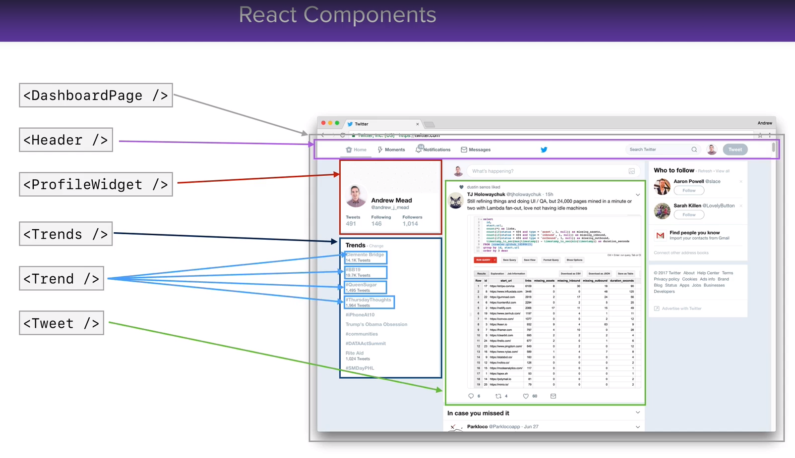
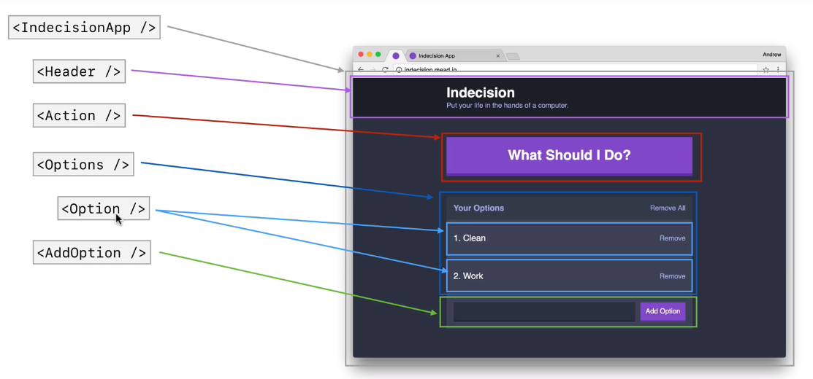

# Introduction

I am taking a react course to better my skills in React by completing actual projects. Course cost \$9.99 on a "New Years Sale".

Course started 01/11/2020.

<!---
References are cited as @mittner2014brain or [@mittner2014brain].
-->

# Developing Tips

Turn on live-server in one terminal:

```sh
live-server public
```

Watch babel make changes in a second terminal:

```sh
babel src/app.js --out-file=public/scripts/app.js --presets=env,react --watch
```

# Video 20 - Picking an Option

[video link](https://www.udemy.com/course/react-2nd-edition/learn/lecture/7707656#content)

buttons can be disabled in HTML:

```html
<button disabled="true">Click me</button>
```

This will start with just a visibility toggle H1 element

```javascript
const render = () => {
  const jsx = (
    <div>
      <h1>Visibility Toggle</h1>
    </div>
  );
  ReactDOM.render(jsx, document.getElementById("app"));
};

render();
```

Ternary Operator. `check visibility = true`, if true button text says "hide details", if `visibility = false` the button text says "show details".

```javascript
{
  visibility ? "Hide details" : "Show details";
}
```

# Video 21 - Build It: Visibility Toggle

[video link](https://www.udemy.com/course/react-2nd-edition/learn/lecture/7707658?components=buy_button%2Cdiscount_expiration%2Cgift_this_course%2Cintroduction_asset%2Cpurchase%2Cdeal_badge%2Credeem_coupon#content)

Creating a visibility toggle application. It's basically just a button to show details will toggle text on / off.

Instead of the normal babel command, run the one below. It watches our visibility toggle app, and compiles it to app.js which the live server is watching:

```sh
babel src\playground\build-it-visible.js --out-file=public/scripts/app.js --presets=env,react --watch
```

# Video 22 - Section Intro: React Components

[video link](https://www.udemy.com/course/react-2nd-edition/learn/lecture/7707668#content)

# Video 23 - Thinking in React

[video link](https://www.udemy.com/course/react-2nd-edition/learn/lecture/7707672#content)





# Video 24 - ES6 Classes: Part I

[video link](https://www.udemy.com/course/react-2nd-edition/learn/lecture/7707674#content)

```sh
babel src/playground/es6-classes-1.js --out-file=public/scripts/app.js --presets=env,react --watch
```

Constructor function is the function that gets called when you make a new instance of a class. Constructors get called implicitly.  
The below code would call the Person class and pass in the string 'Andrew Grube' and the number 30.

```javascript
const me = new Person("Andrew Grube", 30);
```

The below code is a class. The constructor function takes in 2 arguments and sets defaults for their variables.

```javascript
class Person {
  constructor(name = "Anonymous", age = 0) {
    this.name = name;
    this.age = age;
  }
}
```

# Video 25 - ES6 Classes: Part II

[video link](https://www.udemy.com/course/react-2nd-edition/learn/lecture/7707676?start=0#content)

Learning how to create subclasses using the ES6 class syntax.  
Extends is a special keyword to say "we want the class 'student' to extend an existing class, which is 'person'"  
We have to let the parent function do its thing before we do the extended class stuff. We do this by using the keyword "super". Super refers to the parent class. In this case the parent class of 'Student' is 'Person'. And if we call as a function it's the same as calling the parent constructor function.

```javascript
class Person {
  constructor(name = "Anonymous", age = 0) {
    this.name = name;
    this.age = age;
  }
  getGreeting() {
    // return 'Hi. I am ' + this.name + '!';
    return `Hi. I am ${this.name} and I am ${this.age} years old!`;
  }
  getDescription() {
    return `${this.name} is ${this.age} years old.`;
  }
}

class Student extends Person {
  constructor(name, age, major) {
    super(name, age);
    this.major = major;
  }
  hasMajor() {
    return !!this.major;
  }
  getDescription() {
    let description = super.getDescription();
    if (this.hasMajor()) {
      description += ` Their major is ${this.major}`; // description = description + ` Their major is ${this.major}`
    }
    return description;
  }
}
```

# Video 26 - Creating a React Component

[video link](https://www.udemy.com/course/react-2nd-edition/learn/lecture/7707678?start=0#content)

Your classes have to start with an upper case letter.

```javascript
class Header extends React.Component {
  render() {
    return (
      <div>
        <p>This is from header</p>
      </div>
    );
  }
}

const jsx = (
  <div>
    <h1>Title</h1>
    <Header />
  </div>
);

ReactDOM.render(jsx, document.getElementById("app"));
```

# Video 27 - Nesting Components

[video link](https://www.udemy.com/course/react-2nd-edition/learn/lecture/7707680?start=0#content)

Components can render JSX.
Component can render other components.

```javascript
class IndecisionApp extends React.Component {
  render() {
    return (
      <div>
        <Options />
      </div>
    );
  }
}
class Options extends React.Component {
  render() {
    return (
      <div>
        <p>Options component here</p>
        <Option />
      </div>
    );
  }
}

class Option extends React.Component {
  render() {
    return (
      <div>
        <p>Option component here</p>
      </div>
    );
  }
}
ReactDOM.render(<IndecisionApp />, document.getElementById("app"));
```

The above code renders IndecisionApp. IndecisionApp renders a component call Options. Options renders an Option component.

# Video 28 - Component Prompts

[video link](https://www.udemy.com/course/react-2nd-edition/learn/lecture/7707682?start=0#content)

Passing data in when we initialize our components, that data is known as "props". Props is short for properties.

When we create instances of react components, we can also choose to pass some data into it. That data looks very much like HTML attributes, but it's really just a set of key value pairs where the key is some sort of string and the value is anything we like (string, array, number, etc.). When we pass data into a component, we can use that data inside of the component itself. In this case we passed in a title and subtitle, and we used that information to correctly render header.

```javascript
class IndecisionApp extends React.Component {
  render() {
    const title = "Indecision";
    const subtitle = "Put your life in the hands of a computer.";
    return (
      <div>
        <Header title={title} subtitle={subtitle} />
      </div>
    );
  }
}

class Header extends React.Component {
  render() {
    return (
      <div>
        <h1>{this.props.title}</h1>
        <h2>{this.props.subtitle}</h2>
      </div>
    );
  }
}
```

All of your props are available on `{this.props}`. This gives us a way to set up one-way communication.  
For example, <IndecisionApp /> can communicate some information with: `<Header/>`, `<Action />`, `<Options />`, and `<AddOption />`.  
`<Options />` can communication also communicate some information with `<Option />`.  
At the bottom, we can pass some props in : `ReactDOM.render(<IndecisionApp />, document.getElementById("app"));`

# Video 29 - Events & Methods

[video link](https://www.udemy.com/course/react-2nd-edition/learn/lecture/7707684?start=0#content)

We still used our jsx event attributes `onSubmit` and `onClick`.

```javascript
class AddOption extends React.Component {
  handleAddOption(e) {
    e.preventDefault();
    const option = e.target.elements.option.value;
    if (option) {
      alert(option.trim());
    }
  }
  render() {
    return (
      <div>
        <form onSubmit={this.handleAddOption}> <!-- Referenced Line of Code -->
          <input type="text" name="option"></input>
          <button>Add</button>
        </form>
      </div>
    );
  }
}
```

We still referenced a function we want to call. Instead of referencing a global function at the top of the file, we are referencing a class method. A class method is contained inside of the class. That means that `<AddOption />` has everything it needs to run. It has the HTML that is eventually going to render, the event handler, and the event method. The method is defined in the `handleAddOption()`.

We did that for `handleAddOption()`, `handleRemoveAll()`, and `handlePick()` in the `<Action />` component:

```javascript
class Action extends React.Component {
  // handlePick is only accessable by this component as its scope
  // is contained to this component.
  handlePick() {
    alert("handlePick");
  }
  render() {
    return (
      <div>
        <button onClick={this.handlePick}>What Should I Do?</button>
      </div>
    );
  }
}
```

# Video 30 - Method Binding

[video link](https://www.udemy.com/course/react-2nd-edition/learn/lecture/7707686?start=0#content)

Options class has `handleRemoveAll()` and `render()`.

If you do something like this, and then clicking on the "Remove all" button we will get an error "Cannot read property of 'props' of undefined.

```javascript
class Options extends React.Component {
  handleRemoveAll() {
    console.log(this.props.options);
    // alert("some message");
  }
  render() {
    return (
      <div>
        <button onClick={this.handleRemoveAll}>Remove All</button>
        {this.props.options.map(option => (
          <Option key={option} optionText={option} />
        ))}
      </div>
    );
  }
}
```

It looks like we lose our binding to the Options class.

The great thing about bind and why it's useful is that you can use the first argument to set the "this" context. So this means we can set it equal to that 'obj' object bring the context back to what we would expect.

```javascript
const obj = {
  name: "Vikram",
  getName() {
    return this.name;
  }
};

const getName = obj.getName.bind(obj);

console.log(getName());
```

You can also set variables in line:

```javascript
const getName = obj.getName.bind({ name: "Andrew" });
```

More reading: [Deep dive on the bind() function](https://developer.mozilla.org/en-US/docs/Web/JavaScript/Reference/Global_objects/Function/bind)

```javascript
class Options extends React.Component {
  constructor(props) {
    super(props);
    this.handleRemoveAll = this.handleRemoveAll.bind(this);
  }
}
```

Whenever we call `handleRemoveCall()` the context is correct. Which means if we use `handleRemoveCall()` multiple times below, we won't have to type multiple `.bind()` calls inline.  
It also means that we just run the binding once when the component first gets initialized. It doesn't need to get rebound each time the component rerenders.

# Video 31 - What is Component State?

[video link](https://www.udemy.com/course/react-2nd-edition/learn/lecture/7707688#overview)

[Medium Article React State vs Props](https://codeburst.io/react-state-vs-props-explained-51beebd73b21)
[Official React Docs](https://reactjs.org/docs/faq-state.html)
[States and Props in React](https://scotch.io/courses/5-essential-react-concepts-to-know-before-learning-redux/what-is-props-and-state-in-react)

Component state allows our component to manage some data. Think about an object, with various key:value pairs. When that data changes, the component will automatically rerender to reflect those changes.  
We did this in the jsx version of the indecision app where we had to call `render();` at the end of every function.

```javascript
const onRemoveAll = () => {
  app.options = [];
  render();
};
```

With component state all we have to do is manipulate the data and the component will take care of rerendering itself.

# Video 32 - Adding State to Counter App: Part I

[video link]()

# Video 33 - Adding State to Counter App: Part II

[video link]()
